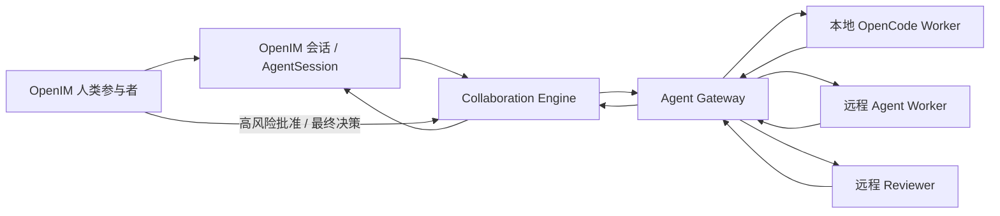

# Agent Gateway 与 OpenIM 分布式协作

## 1. 架构

OpenIM 会话是协作边界和交付界面。人和 Agent 都是带有稳定身份、角色和审计记录的一等参与者。



核心边界：

- OpenIM `conversationID` 保留现有单聊/群聊身份关系和消息上下文；
- AgentSession `sessionID` 保存用户可见消息、附件和 Runtime 绑定；
- Gateway Session 保存分布式控制面的会话生命周期；
- Gateway Run 保存一次可领取、可重试的执行；
- Collaboration 保存 participant、task、review 和 human intervention；
- 最终文本或附件不会自动发送到 IM，必须由人类确认后使用现有发送/附件入口交付。

## 2. 持久状态

默认位于 Electron `userData/OpenIMData/agent-gateway`：

| 文件                  | 内容                                              |
| --------------------- | ------------------------------------------------- |
| `state.json`          | Agent、Gateway Session、Run、事件和权限审计       |
| `collaborations.json` | 协作 Session、参与者、Task、Review 与人工介入事件 |
| `access.token`        | Gateway 管理员凭据，创建时使用受限文件权限        |

Gateway Snapshot v2 增加独立 Session。读取旧 v1 Snapshot 时，会从已有 Run 合成 Session，保证升级后仍可恢复。

文件保存采用同目录临时文件加原子重命名，避免进程退出时产生半写入 JSON。

## 3. 状态模型

### 3.1 Agent

`online` → 心跳超时 → `offline`。重新注册或心跳可恢复在线。

Agent 使用 Capability 发现，例如 `run.execute`、`run.streaming`、`artifact.publish`，调度器不根据 Runtime 名称猜测能力。

### 3.2 Session

`active` → `closed`

- Session 固定绑定一个 `conversationID`；
- 相同 `sessionID` 的创建是幂等的；
- 已关闭 Session 不允许创建新 Run；
- Session 的 `updatedAt` 随 Run 创建和事件推进；
- Session 与 Run 一起持久化并可在重启后恢复。

### 3.3 Run

```text
queued
  -> running
  -> waiting_permission | waiting_question
  -> running
  -> completed | failed | aborted
```

规则：

- 幂等范围为 `conversationID + idempotencyKey`；
- 只有目标 Agent 可以 Claim；
- Claim 带租约，Worker 周期续租；
- 进程崩溃或租约过期后，Run 在 `maxAttempts` 内重新排队，耗尽后失败；
- Event 使用稳定 `eventID` 去重，并由 Gateway 分配连续 `sequence`；
- 终态 Run 拒绝新事件；
- 重试保留同一 Run ID 并递增 `attempt`。

## 4. HTTP API

默认监听 `127.0.0.1:4097`，可由 `agent.gateway` 配置修改。

| 方法     | 路径                                 | 权限               | 用途                          |
| -------- | ------------------------------------ | ------------------ | ----------------------------- |
| POST     | `/v1/agents/register`                | admin              | 注册 Agent 并轮换 Agent Token |
| POST     | `/v1/agents/:id/heartbeat`           | admin / 同一 Agent | 心跳                          |
| GET      | `/v1/agents`                         | admin / Agent      | Capability 发现               |
| POST/GET | `/v1/sessions`                       | admin              | 创建/查询持久 Session         |
| GET/POST | `/v1/sessions/:id[/close]`           | admin              | 获取/关闭 Session             |
| POST/GET | `/v1/runs`                           | admin              | 创建/查询 Run                 |
| GET      | `/v1/agents/:id/runs?available=true` | admin / 同一 Agent | 获取可领取 Run                |
| POST     | `/v1/runs/:id/claim`                 | admin / 目标 Agent | 领取 Run                      |
| POST     | `/v1/runs/:id/renew-claim`           | admin / 目标 Agent | 续租                          |
| GET/POST | `/v1/runs/:id/events`                | admin / 目标 Agent | 读取/追加事件                 |
| POST     | `/v1/runs/:id/retry`                 | admin              | 重试失败 Run                  |
| POST     | `/v1/runs/:id/abort`                 | admin              | 治理下终止 Run                |
| GET      | `/v1/metrics`                        | admin              | 指标                          |
| GET      | `/v1/audits`                         | admin              | 审计                          |
| POST     | `/v1/authorize`                      | admin              | 权限决策和审计                |

所有请求使用 `Authorization: Bearer <token>`。

## 5. 认证与治理

凭据分为两类：

1. **Admin Token**：控制面凭据，只保存在本机 Token 文件或安全配置中。它可以创建 Session/Run、注册 Agent、执行人工授权和读取审计。
2. **Agent Token**：注册响应中签发，使用 HMAC 绑定 `agentID + credentialID`。它只能查看、领取、续租和回报自己的 Run。

同一 Agent 重新注册会轮换 `credentialID`，旧 Agent Token 立即失效。远程 Worker 不应获得 Admin Token。

默认策略：

- 高风险动作必须有有效的人类批准；
- Agent 发起的 `permission.reply` 和 `artifact.publish` 必须有人类批准；
- 人类批准有五分钟有效期，并容忍一分钟时钟偏差；
- 非法 action、actor type 或 risk level 被拒绝；
- allow、require_human 等决策都会写入审计；
- Agent Token 无法访问授权接口，因此不能伪造人类批准。

当 Gateway 暴露到非本机网络时，应在反向代理或服务网格层增加 TLS、主机访问控制和 Token 安全分发。

## 6. 远程 Agent 最小接入

控制面用 Admin Token 注册一次：

```ts
import { AgentGatewayHttpClient, AgentGatewayWorker } from "./electron/agent-core";

const admin = new AgentGatewayHttpClient("http://gateway:4097", {
  authToken: process.env.GATEWAY_ADMIN_TOKEN,
});

const registration = await admin.registerAgent({
  agentID: "reviewer-east-1",
  runtimeID: "my-review-runtime",
  displayName: "East Reviewer",
  endpoint: "https://reviewer-east-1.example",
  capabilities: ["run.execute", "run.streaming"],
});
```

执行面只保存签发的 Agent Token：

```ts
const transport = new AgentGatewayHttpClient("http://gateway:4097", {
  agentID: "reviewer-east-1",
  authToken: registration.accessToken,
});

const worker = new AgentGatewayWorker(
  transport,
  {
    async execute(run, hooks) {
      await hooks.onState("running");
      return {
        summary: await executeWithMyRuntime(run.input),
      };
    },
  },
  { agentID: "reviewer-east-1" },
);

worker.start();
```

Worker 自动完成：

- 轮询自己的可用 Run；
- 原子 Claim；
- 周期续租；
- 转发等待权限/问题状态；
- 发布 completed/failed；
- 在输入包含 `collaborationID` 时，将终态事件交给协作 Coordinator 汇聚。

## 7. 会话内协作

角色：

| 角色       | 可由                                | 职责                    |
| ---------- | ----------------------------------- | ----------------------- |
| `driver`   | 人或 Agent，UI 默认当前 OpenIM 用户 | 拆解、委派和发起 Review |
| `worker`   | 人或 Agent                          | 并行执行 Task           |
| `reviewer` | 人或 Agent                          | 汇聚后独立复核          |
| `observer` | 人或 Agent                          | 观察事件，不执行任务    |

最小闭环：

1. 在当前 OpenIM conversation 和 AgentSession 下创建 Collaboration；
2. Driver 以稳定 delegation key 创建多个独立 Task；
3. Coordinator 并行创建 Gateway Run；
4. Worker 领取并回报输出/附件；
5. Driver 发起 Reviewer Task；
6. Reviewer 的完成只产生“等待人类最终决定”，不会自动完成协作；
7. 人类可以批准、拒绝或要求修订；
8. 修订重新进入 Worker → Reviewer → Human；
9. 最终结果投影为 AgentSession 消息，仍由人类决定是否发到 OpenIM 群聊。

人工 Task 会保留在 ready 列表中，不会错误地当作 Agent Run 调度。

## 8. 恢复与可观测性

启动时：

- 恢复 Agent、Session、Run、事件和审计；
- 恢复 Collaboration 与 Task；
- 重新注册本地 OpenCode Agent；
- 过期 Claim 自动重排或失败；
- 终态失败与 Collaboration Task 对账；
- Collaboration 事件重新投影到 AgentSession，使用事件 ID 去重。

指标包含：

- 在线/离线 Agent 数；
- active/closed Session 数；
- 各 Run 状态数量；
- 重试次数、事件数；
- allow/deny/require_human 审计数。

## 9. 验收

```bash
npm test
npm run lint -- --quiet
npm run build
npm run e2e
```

契约测试覆盖注册发现、Agent Token 隔离与轮换、Session v1→v2 迁移、Run 幂等/序列/租约/重试、HTTP 远程 Worker、Gateway+Collaboration 联合重启恢复、高风险授权以及 worker/reviewer/人工修订闭环。
